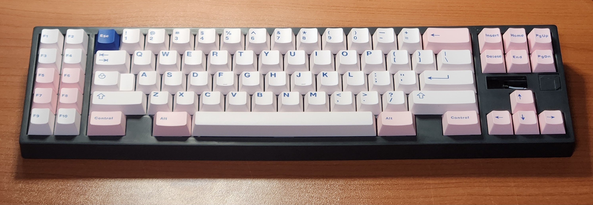

# Gear80 
The Gear80 is a 80% keyboard based on the rp2040.

 

    
  

- gear80_wkl (sla print)

  

알루미늄 하우징은 2달안에 제작할듯 합니다. 
- gear80_wkl (cnc)

  

## Layout 

- gear80 hotswap, solder

 
 

- gear80-a solder
 
 

 

There is also a [keyboard plate](https://github.com/cosmosalad/Gear80/tree/main/plate). 
[Keyboard case](https://github.com/cosmosalad/Gear80/tree/main/case) corresponding to this layout. 

  

## PCB 
It may differ from the sample photo and file. 
 
 

 

 
 
[More pcb ](https://github.com/cosmosalad/Gear80/tree/main/pcb) 

This pcb was made by jlcpcb.(list of pcb parts [main](https://github.com/cosmosalad/Gear80/blob/main/pcb/Gear80%20solder/part%20list.md), [daughterboard](https://github.com/cosmosalad/Gear80/blob/main/pcb/daughterboard/part%20list.md/))  

This pcb prepared the [vial](https://github.com/cosmosalad/Gear80/tree/main/vial) as firmware  

  

 
